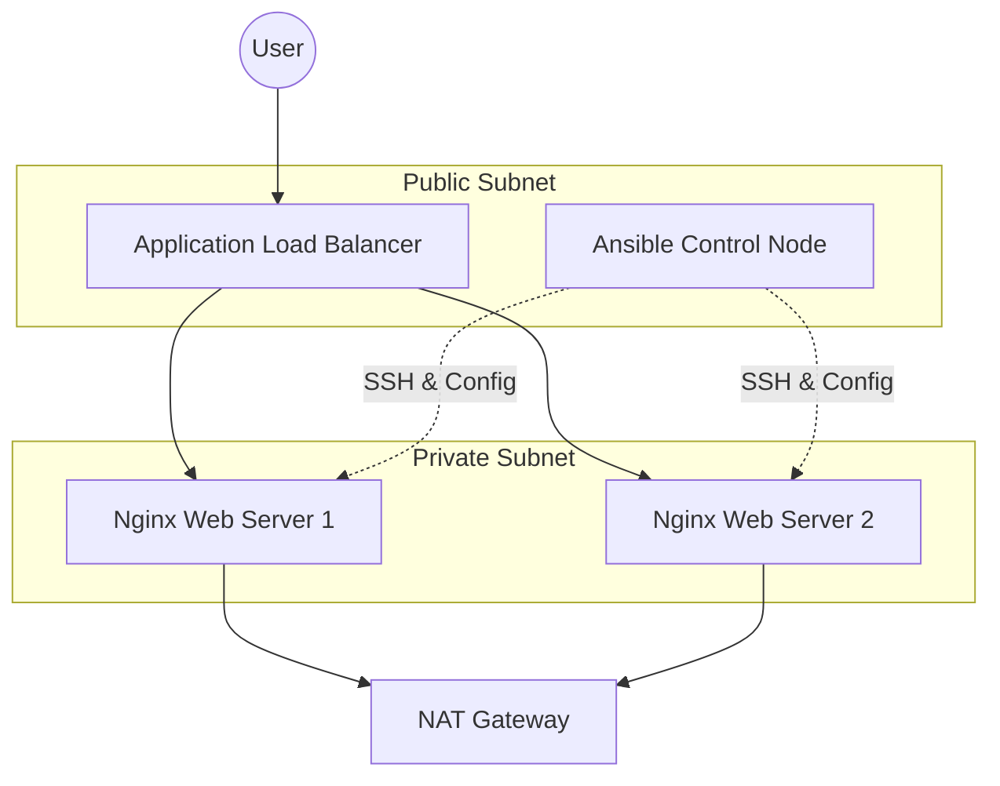

# Automated Control Plane & Self-Healing Web Stack

[](https://www.terraform.io/)
[](https://www.ansible.com/)
[](https://aws.amazon.com/)

This project demonstrates a production-ready, resilient AWS architecture. It features a centralized **Management Control Node** that autonomously discovers and configures a fleet of private web servers using Terraform and Ansible.

## 🏗️ Architecture

The stack is designed with high availability and security in mind:

- **VPC & Networking:** A custom VPC with Public and Private subnets.
- **Control Plane:** A public-facing Control Node pre-configured with the automation engine.
- **Web Tier:** Private web servers managed by an **Auto Scaling Group (ASG)**.
- **Load Balancing:** An **Application Load Balancer (ALB)** to distribute traffic.
- **Connectivity:** A NAT Gateway allows private instances to securely pull updates without being exposed to the internet.



## 🌟 Key Features & Benefits

| Feature | Benefit |
| :--- | :--- |
| **Self-Healing** | If a web instance fails, the ASG automatically replaces it, and the Control Plane re-configures it instantly. |
| **Security** | Web servers are located in private subnets, only accessible via the ALB or the Control Node. |
| **Scalability** | Easily scale the web tier from 2 to 100+ instances by simply updating a Terraform variable. |
| **Idempotency** | Ansible ensure the "Desired State" is always maintained without redundant operations. |
| **Dynamic Discovery** | Uses the `aws_ec2` plugin to automatically find new servers via AWS tags—no static IP lists needed. |

## 🚀 Getting Started

### Prerequisites
- AWS CLI configured with appropriate permissions.
- Terraform installed locally.
- An SSH Key Pair (`my-anisible-terraform-key.pem`) available in the project root.

### Deployment

1. **Provision Infrastructure:**
   ```bash
   cd terraform
   terraform init
   terraform apply -auto-approve
   ```

2. **Bootstrap the Control Plane:**
   - Transfer your SSH key to the Control Node.
   - The Control Node will automatically install Ansible and Git via its User Data script.

3. **Configure the Web Stack:**
   From the Control Node:
   ```bash
   ansible-playbook site.yml
   ```

## 🛠️ Tech Stack
- **Infrastructure:** Terraform
- **Configuration Management:** Ansible (Dynamic Inventory)
- **Cloud:** AWS (VPC, EC2, ASG, ALB, IAM, NAT GW)
- **OS:** Amazon Linux 2023
- **Web Server:** Nginx
