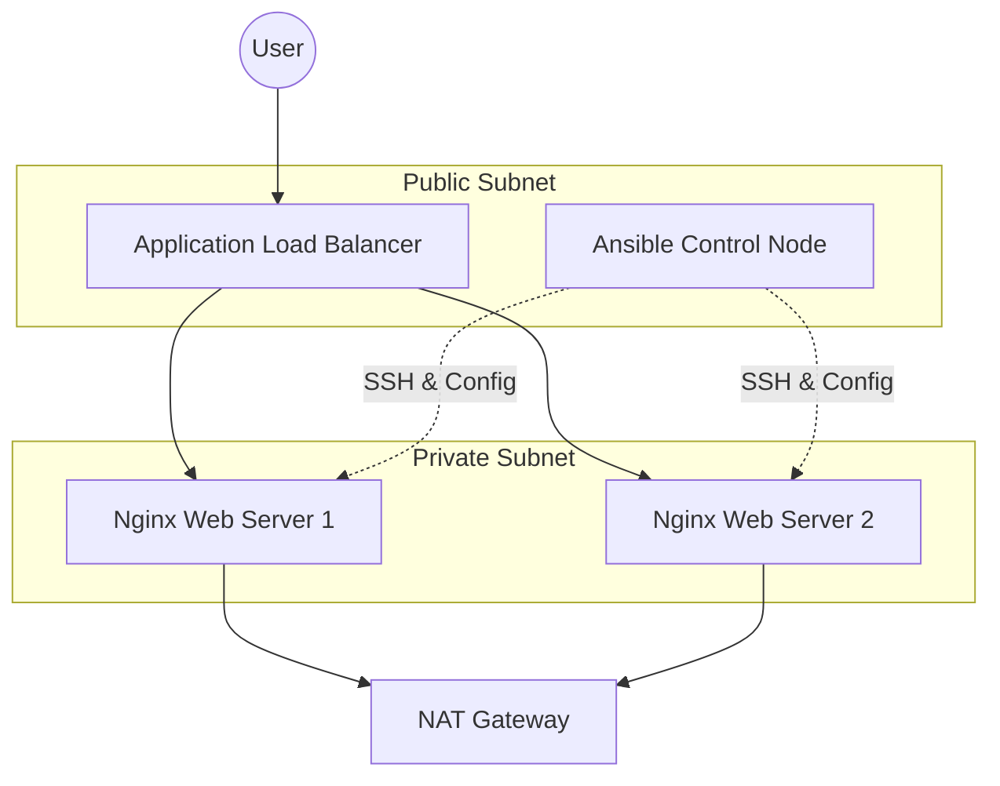

# Automated Control Plane & Self-Healing Web Stack

[](https://www.terraform.io/)
[](https://www.ansible.com/)
[](https://aws.amazon.com/)
[](https://github.com/young-1sensei/self-healing-web-stack/actions)

This project demonstrates a production-ready, resilient AWS architecture. It features a centralized **Management Control Node** that autonomously discovers and configures a fleet of private web servers using Terraform and Ansible.

## 🏗️ Architecture

The stack is designed with high availability and security in mind:

- **VPC & Networking:** A custom VPC with Public and Private subnets.
- **Control Plane:** A public-facing Control Node pre-configured with the automation engine.
- **Web Tier:** Private web servers managed by an **Auto Scaling Group (ASG)**.
- **Load Balancing:** An **Application Load Balancer (ALB)** to distribute traffic.
- **Connectivity:** A NAT Gateway allows private instances to securely pull updates without being exposed to the internet.



## 🌟 Key Features & Benefits

| Feature | Benefit |
| :--- | :--- |
| **Self-Healing** | If a web instance fails, the ASG automatically replaces it, and the Control Plane re-configures it instantly. |
| **Drift Detection** | A periodic cron job on the Control Node ensures that configuration "drift" is corrected every 5 minutes. |
| **Security** | Web servers are located in private subnets, only accessible via the ALB or the Control Node. |
| **Scalability** | Easily scale the web tier from 2 to 100+ instances by simply updating a Terraform variable. |
| **CI/CD Pipeline** | Integrated GitHub Actions for automated Terraform formatting, planning, and deployment. |
| **Dynamic Discovery** | Uses the `aws_ec2` plugin to automatically find new servers via AWS tags—no static IP lists needed. |

## 🚀 Getting Started

### Prerequisites
- AWS CLI configured locally.
- Terraform installed locally.
- An SSH Key Pair available in your AWS account.
- **GitHub Secrets:** Add `AWS_ACCESS_KEY_ID` and `AWS_SECRET_ACCESS_KEY` to your repository settings to enable CI/CD.

### Deployment

1. **Initial Provisioning:**
   Push changes to the `main` branch to trigger the GitHub Actions workflow, or run manually:
   ```bash
   cd terraform
   terraform init
   terraform apply -auto-approve
   ```

2. **Setup Automation on Control Node:**
   Transfer your SSH key to the Control Node and set up the automated healing script:
   ```bash
   # On your local machine
   scp -i your-key.pem your-key.pem ec2-user@<CONTROL_NODE_IP>:~/
   
   # On the Control Node
   chmod +x ~/run-ansible.sh
   (crontab -l 2>/dev/null; echo "*/5 * * * * ~/run-ansible.sh") | crontab -
   ```

3. **Verify Configuration:**
   Monitor the logs on the Control Node to see the periodic configuration runs:
   ```bash
   tail -f ~/ansible-run.log
   ```

## 🛠️ Tech Stack
- **Infrastructure:** Terraform
- **Configuration Management:** Ansible (Dynamic Inventory)
- **CI/CD:** GitHub Actions
- **Cloud:** AWS (VPC, EC2, ASG, ALB, IAM, NAT GW)
- **OS:** Amazon Linux 2023
- **Web Server:** Nginx
